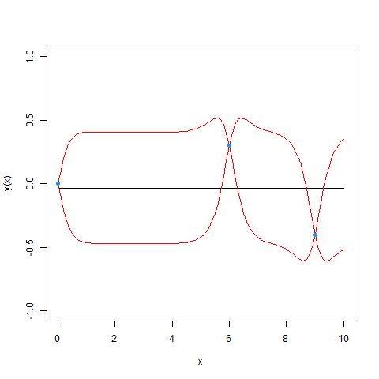
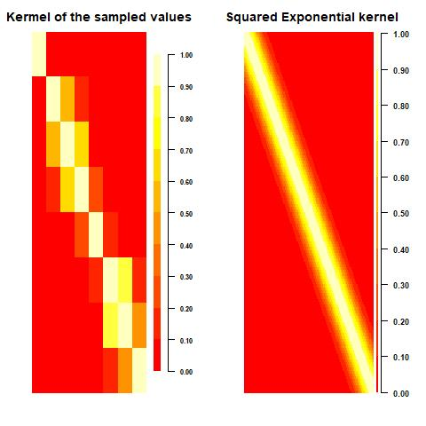
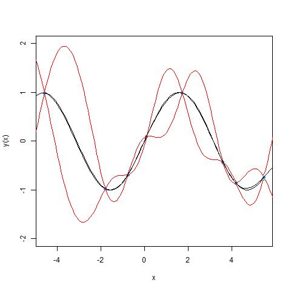
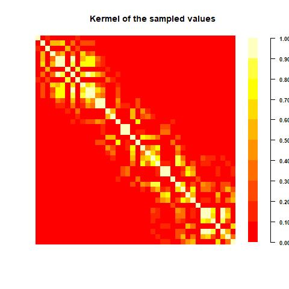
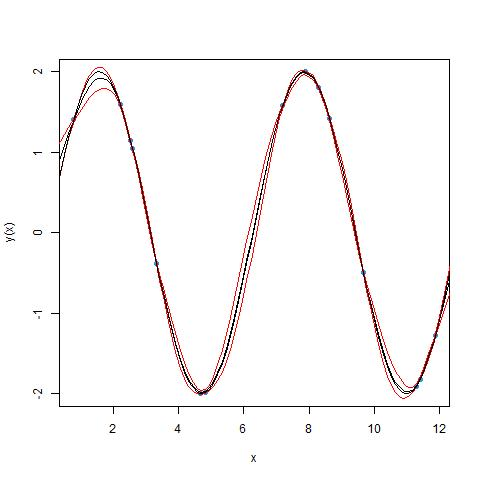

---
output:
 github_document:
  math_method:
    engine: webtex
    url: https://latex.codecogs.com/svg.image?
---

<!-- README.md is generated from README.Rmd. Please edit that file -->

```{r, include = FALSE}
knitr::opts_chunk$set(
  collapse = TRUE,
  comment = "#>",
  fig.path = "man/figures/README-",
  out.width = "100%"
)
knitr::opts_chunk$set(echo = FALSE)
knitr::opts_chunk$set(message = FALSE)
knitr::opts_chunk$set(warning = FALSE)
knitr::opts_chunk$set(error = FALSE)
knitr::opts_chunk$set(out.width="50%")
knitr::opts_chunk$set(fig.align="center")
```

# AvGPR

<!-- badges: start -->
<!-- badges: end -->

AvGPR is a package that calculates a weighted average Gaussian Process regression model over 5 implementations from packages in both R and Python. It uses cross validation to optimise the weights to select the regression models that are best capturing the data.

## Installation

You can install the development version of AvGPR from [GitHub](https://github.com/) with:

``` r
# install.packages("devtools")
devtools::install_github("benjmuller/AvGPR")
```

This package requires the python modules 'numpy', 'GPy', 'sklearn', and 'warnings' in the python virtual environment. These modules can be installed onto the current reticulate python virtual environment with:

``` r
install_python_packages()
```

Alternatively, the models can be installed on a new python environment with:

``` r
create_python_environment()
```

## Example

This is a basic example of a simple GPR using the AvGPR function:

``` r
library(AvGPR)
# create_python_environment()
set.seed(1)
n <- 15
X <- runif(n, min = 0, max = 4 * pi)
Y <- 2 * sin(X)
XX <- seq(0, 4 * pi, length.out=100)
AvGPR(data.frame(X=X), data.frame(Y=Y), data.frame(X=XX))
```

# Gaussian Process Tutorial

## Introduction

This document is an introduction to Gaussian Process regression (GPR) where it will discuss; how it works, an intuitive way to think about it and show some code for real-world examples.

## Background

A Gaussian process is a stochastic process that is used to emulate an event that has normally distributed random variables which are indexed over time or space. Gaussian processes are formed by the joint distribution of these normal random variables. Gaussian Processes can be used as a non-linear multivariate interpolation tool. This process is called Gaussian Process regression or Kriging. Using this method, we can write multi-output prediction problems in the following parametric form: 

<center>

$$\hat{y}(x)=m(x)+Z(x),$$ 

</center>

where $\hat{y}$ is the simulated output, $m$ is the mean function and $Z$ is zero-mean Gaussian Process. The mean function is a "best fit" parametric function of the independent variables. The zero-mean Gaussian Process is specified by a covariance function. There are many choices of covariance functions that better suit different types of events being emulated. A list of some standard functions can be found here (<https://www.cs.toronto.edu/~duvenaud/cookbook/>).


## Idea behind Gaussian Processes

A way to understand Gaussian processes, in particular, getting the parametric from the non-parametric form, is by considering a bivariate normal:

<center>

{width="40%"}

</center>


<br>
The normal distributions that construct the bivariate normal have covariance 1, hence the conditioning of an observation (data point) gives information about what possible values the other random variable can take. Consider the observation $Y_0=0$ and plotting some random samples of possible values for the conditional distribution $Y_1|Y_0=0$:

<center>

{width="50%" }

</center>

<br>

Consider expanding this notion to a 10-variate normal distribution where we fix $Y_0=0$ with $Y_i \sim N(0,2)$ with correlations that are specified by the squared exponential covariance function (SE):

<center>

{width="50%" height="20%"}

</center>

<br>

Now suppose we condition the observations $Y_0=0$, $Y_6=0.3$ and $Y_9=-0.4$ and plot samples of possible values:

<center>

{width="50%"}

</center>

<br>

The families of curves that join the points are subsets to the family of solutions which are compatible with the imposed values. If we take a large number of these sample curves, we can see that they will appear to give regions of confidence. It is clear that at this stage, this becomes a nonlinear regression problem. So, setting the mean and the covariance function to be parametric functions that define the covariance in the discrete multivariate case. This gives us the construction of the Gaussian Process regression.

<center>

{width="40%"}

</center>

## 1-Dimensional Example

In this section we will go through a one dimensional example of Gaussian process regression. The data is created from a random sample of 8 points on the sine function in the domain $[-2 \pi, 2 \pi]$. The randomly generated values that will be used in this example are: 

<center>

$$
-4.572  \quad -1.788 \quad-0.761 \quad 0.095 \quad 1.727 \quad 3.585 \quad 4.181 \quad 5.454
$$

</center>

```{r}
x.train <- data.frame(x.train = c(-4.572, -1.788, -0.761, 0.095, 1.727, 3.585, 4.181, 5.454))
y.train <- data.frame(y.train = sin(x.train))
```

The covariance function that this example will be using is the squared exponential function (SE). This has the form 

<center>

$$k(x_i, x_j)=\sigma ^2 \exp \left(\frac{-1}{2l^2}\sum^d_{k=1}(x_{i,k}-x_{j,k})^2 \right)$$

</center>

<br>

Using the samples and the chosen covariance function, this gives the covariance matrix:

```{r,echo=TRUE}
library(plgp)

kernel <- function(x1, x2, sigma = 1, l = 1) {
  matrix.dist <- distance(x1,x2)
  kern <- (sigma ^ 2) * exp(- matrix.dist / (2 * l ^ 2))
  return(kern)
}

```

<br>

$$
K=
\begin{pmatrix}
  1.0000 & 0.0208 & 0.0007 & 1.8635 \times 10^{-5} & 2.4219\times 10^{-9} & 3.5625\times 10^{-15} & 2.3081\times 10^{-17} & 1.4867\times 10^{-22} \\
  0.0208 & 1.0000 & 0.5902 & 0.1699 & 0.0021 & 5.3845\times 10^{-7} & 1.8335\times 10^{-8} & 4.0867\times 10^{-12} \\
  0.0007 & 0.5902 & 1.0000 & 0.6933 & 0.0453 & 7.9174\times 10^{-5} & 4.9720\times 10^{-6} & 4.0966\times 10^{-9} \\
  1.8635\times 10^{-5} & 0.1699 & 0.6933 & 1.0000 & 0.2640 & 0.0023 & 0.0002 & 5.8046\times 10^{-7} \\
  2.4219\times 10^{-9} & 0.0021 & 0.0453 & 0.2640 & 1.0000 & 0.1780 & 0.0492 & 0.0010 \\
  3.5625\times 10^{-15} & 5.3845\times 10^{-7} & 7.9174\times 10^{-5} & 0.0023 & 0.1780 & 1.0000 & 0.8373 & 0.1744 \\
  2.3081\times 10^{-17} & 1.8335\times 10^{-18} & 4.9720\times 10^{-6} & 0.0002 & 0.0492 & 0.8373 & 1.0000 & 0.4447 \\
  1.4867\times 10^{-22} & 4.0867\times 10^{-12} & 4.0966\times 10^{-9} & 5.8046\times 10^{-7} & 0.0010& 0.1744 & 0.4447 & 1.0000
\end{pmatrix} 
$$

<br>

Here we will plot a coloured gradient to give a visual representation of the correlations between each of the random variables. This is beneficial when the matrix is large, as there are too many values to reliably interpolate the behaviors. 

<center>

{width="40%" height="20%"}

</center>

Using the covariance function to construct covariance matrices from combinations of the observed data and data we want to predict, we can calculate the posterior distribution. The posterior mean vector and covariance matrix are given (respectively) by:

<center>

$$
\mu_* = K^T_*K^{-1}y \\
\Sigma_* = K_{**} - K^T_*K^{-1}K_*
$$ 

</center>

where $y$ are the outputs from the observed data, $K$ is the kernel for the observed data, $K_*$ is the kernel for the observed data against the data we want to predict and $K_{**}$ is the kernel for the data we want to predict.

<br>

```{r, echo=TRUE}
posterior <- function(xvals.s, x.train, y.train, sigma = sigma, l = l, sigma.y = 1e-8) {
  n <- nrow(x.train); m <- nrow(xvals.s)
  k <- kernel(x.train, x.train, sigma = sigma, l = l) + sigma.y ^ 2 * diag(n)
  k.s <- kernel(x.train, xvals.s, sigma = sigma, l = l)
  k.ss <- kernel(xvals.s, xvals.s, sigma = sigma, l = l) + 1e-8 ^ 2 * diag(m)
  k.inv <- solve(k)
  y.train <- data.matrix(y.train)
  colnames(y.train) <- NULL
  mu <- t(k.s) %*% k.inv %*% y.train
  cov <-  k.ss - t(k.s) %*% k.inv %*% k.s
  
  return(list(mu, cov))
}
```

<br>

Using the predictive distribution, we can plot the Gaussian process by choosing the data we want to predict to be a large sample of points of the domain:

<center>

{width="40%"}

</center>

## 2-Dimensional Example

In this example we will be using the Branin function which has the form: $a(x_2 - bx_2^2+cx_1-r)^2+s(1-t)\cos(x_1)+s$. We will be using the parameters $a=1$, $b=\frac{5.1}{4 \pi ^ 2}$, $c=\frac{5}{\pi}$, $r=6$, $s=10$ and $t=\frac{1}{8\pi}$. The range of values $x_1$ and $x_2$ can take are $x_1 \in [-5,10]$ and $x_2 \in [0,15]$. This example will use 40 random samples as training data.

```{r}
x1.train <- c(-4.9647522, -4.8771445, -4.7579291, -3.2000445, -3.0584365, -2.9622933, -2.4649231, -2.2169861, -1.9026550, -1.7402114, -1.6210020, -1.5219531, -0.4601052, -0.1754564,  0.7335437,  0.7577958,  1.5517322,  2.0506812, 2.5889025, 2.6257776, 2.6300766, 3.4227331, 3.7725147, 4.8884970, 5.0909486, 5.4098474, 5.5398671, 5.5446207, 6.0230538, 6.9599826, 7.0525725, 7.3098817, 8.3451094, 8.4350698, 8.6981159, 8.8617430, 9.0971324, 9.1362161, 9.2434436, 9.2709828)
x2.train <- c(14.036265722, 1.553652567, 10.043269711, 0.003207063, 2.718103240, 2.089909165, 10.252864334, 2.927173247, 11.359887728, 1.113601568, 2.879734633, 2.158296446, 4.331145115, 4.895968193, 12.085026470, 14.217729002, 2.659192731, 7.858535377, 7.791869449, 13.070631742, 3.502962389, 11.943482459, 14.646998268, 13.353045385, 11.932415458, 7.802640401, 7.929800668, 2.771915733, 12.676700918, 11.063708444, 7.324328448, 9.463022200, 0.690005195, 13.443323850, 13.167826475, 14.853168663, 7.031075695, 13.799932332, 11.538392374, 8.718763586)
y.train <- (x2.train - (5.1 / (4 * pi ^ 2)) * x1.train ^ 2 + (5 / pi) * x1.train - 6) ^ 2 + 10 * (1 - 1 / (8 * pi)) * cos(x1.train) + 10
x.train <- data.frame(x1.train, x2.train)
```

Since the covariance matrix has dimensions 40x40, it is difficult to understand the behavior by looking at the correlation coefficients. So we will plot a coloured gradient for the correlations. We will be using the same SE function to calculate the covariance coefficients. Plotting the covariance gradient:

<center>

{width="40%"}

</center>

Using the same matrix multiplication as for the one-dimensional case, we can calculate the predictive distribution for this Gaussian process. Using this we can plot the GP:

```{r, echo=TRUE, eval=FALSE}
library(rgl)
plotgp_2D <- function(x1, x2, x.train, y.train, sigma = 1, l = 1, xlimit = c(), ylimit = c(), zlimit = c()) {
  xvals <- expand.grid(x1, x2)
  mu <- posterior(xvals, x.train, y.train, sigma = sigma, l = l)[[1]]
  
  zlim <- range(mu)
  zlen <- zlim[2] - zlim[1] + 1
  colorlut <- hcl.colors(zlen, palette = "Blues")
  col <- colorlut[ mu - zlim[1] + 1 ]
  persp3d(x=x1, y=x2, z=mu, color=col, zlab = "y(x1, x2)")
}

x1 <- seq(from = -5, to = 10, by = 0.2)
x2 <- seq(from = 0, to = 15, by = 0.2)
plotgp_2D(x1, x2, x.train, y.train, sigma = 1, l = 2)
```

<center>

{width="40%"}

</center>

## Higher dimensional Examples

In this section we have some example functions for higher dimensional Gaussian Process regression.

### Borehole function (8-dimensional)

The borehole function models water flowing through a borehole. The equation has the form: 

<center>

$$
f(x)=\frac{2\pi T_u(H_u-H_l)}{ln\left(\frac{r}{r_w}\right)\left(1+\frac{2LT-u}{ln\left(\frac{r}{r_w}\right)r_w^2K_w} + \frac{T_u}{T_l} \right)} .
$$

</center>

### OTL Circuit Function (6-dimensional)

The OTL Circuit function models an output transformerless push-pull circuit. The equation has the form: 

<center>

$$
V_m(x)=\frac{(V_{b1} + 0.74)\beta (R_{x2}+9)}{\beta(R_{c2}+9)+R_f} + \frac{11.35R_f}{\beta (R_{c2}+9)+R_f} + \frac{0.74R_f\beta(R_{c2}+9)}{(\beta(R_{c2}+9)+R_f)R_{c1}}, \\ \text{ where }
V_{b1}=\frac{12R_{b2}}{R_{b1}+R_{b2}}.
$$

</center>

### Piston Simulation Function (7-dimensional)

The piston simulation function models the circular motion of a piston within a cylinder. The equation has the form: 

<center>

$$
C(x) = 2 \pi \sqrt{\frac{M}{k+S^2\frac{P_0V_0}{T_0}\frac{T_a}{V^2}}},\\ \text{ where }
V = \frac{S}{2k}\left( \sqrt{A^2 + 4k \frac{P_0V_9}{T_0}T_a} - A  \right), \\
A=P_0S + 19.62M - \frac{kV_0}{S}.
$$

</center>

### Robot Arm Function (8-dimensional)

The robot arm function models the position of a 4 segment robotic arm. The equation has the form: 

<center>

$$ 
f(x) = (u^2 + v^2)^{0.5}, \\ \text{ where } 
u= \sum^4_{i=1}L_i\cos\left(\sum^i_{j=1} \theta_j\right), \\
v= \sum^4_{i=1}L_i\sin\left(\sum^i_{j=1} \theta_j\right).
$$

</center>

## AvGPR

AvGPR (Average Gaussian Process Regression) is an R package that uses weighted model averaging to calculate an average Gaussian Process regression model. It does this by emulating 5 different GPR packages then through cross validation, it calculates a "goodness of fit" parameter which is used to find the weight for each model. This is an advantageous method of regression as it gains the benefits associated with model averaging. The measure of fit statistic that is used in this package is:

<center>

$$
\sum^n_{i=1}[(\sigma_i - \epsilon_i) ^ 2 + \epsilon_i^2],
$$

</center>

where $i$ denotes the predicted point, $\sigma_i$ is the variance of i, and $\epsilon_i$ is the residual. Through analysis and experimentation, this statistic has shown to provide a better representation of the fit than RSS and normalised RSS. 

Here is an example plot from an AvGPR regression:

<center>

{width="40%"}

</center>


<https://github.com/benjmuller/AvGPR>


